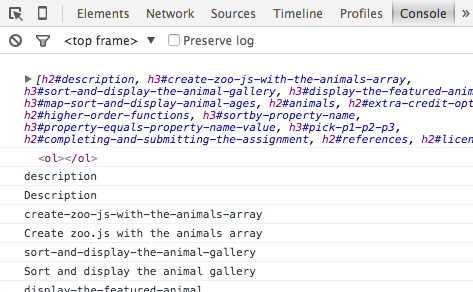
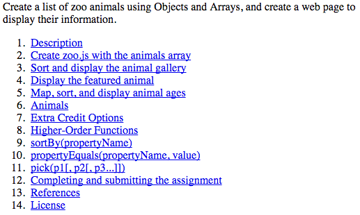
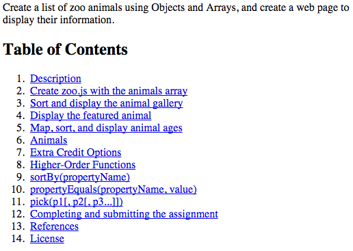

Walk-Through: Auto Table of Contents
====================================

In this walk-through, we are going to write JavaScript to auto-generate a 
table of contents for an article based on the headings in the HTML document.
Along the way we’ll be learning and using [several vital DOM methods](#references).

We will be working with a modified version of the [ZooKeep](https://github.com/unioncollege-webtech/zookeep#zookeep)
assignment description. The source HTML that we’re working with is in [index.html](./index.html).

“index.html” already [contains a script](./index.html#L304) element loading [toc.js](./toc.js).
The code examples below should be added to “toc.js” to auto-generate our table 
of contents.


Step 1: Find the heading elements
---------------------------------

Use [`document.querySelectorAll`][dqsa] to find all the headings in the article 
**except** for the h1 (i.e. h2, h3, h4, h5, h6).

    var headings = document.querySelectorAll("h2, h3, h4, h5, h6");

Just to ensure that our code is working as expected so far, use [`console.log`][log]
to display `headings` in the browser’s console.

    console.log(headings);

At this point, if you haven’t already, open “index.html” in a browser. Activate
the Developer Tools and the Console. Refresh the page and make sure the NodeList
of heading elements is logged to the console. You should see something like
this, though the exact output varies by browser:

![▶ [h2#description, h3#create-zoo-js-with-the-animals-array, ...]](./resources/console-log-headings.png)


Step 2: Create an ordered list
------------------------------
Our table of contents will be an ordered list of links to the individual
sections of our document. The user will be able to click on these links to jump
directly to specific sections.

Use [`document.createElement`][ce] to create a new [`ol` element][ol] that will
hold the table of contents list.

    var tocList = document.createElement('ol');

Again, to ensure that our code is functioning correctly, log `tocList` to the
console.

    console.log(tocList);


Step 3: Loop through the headings
---------------------------------
Loop through the headings using a [`for`][for] loop and build a list of links to
the different sections of the document. The final HTML for the table of contents
list will look something like the following:

```html
<ol>
  <li>
    <a href="#description" rel="internal">Description</a>
  </li>
  <li>
    <a href="#create-zoo-js-with-the-animals-array" rel="internal">Create zoo.js with the animals array</a>
  </li>
  <li>
    <a href="#sort-and-display-the-animal-gallery" rel="internal">Sort and display the animal gallery</a>
  </li>
  <li>
    <a href="#display-the-featured-animal" rel="internal">Display the featured animal</a>
  </li>
  ...
</ol>
```

To generate the content above, we will use the `id` attribute from the
headings to generate the fragment identifier for the `href` attribute on the
`a` elements, and use the heading text for the `a` element’s content.

Just so we are certain that we have access to the necessary information, let’s 
start by creating a `for` loop that just logs the [`id`][id] and
[`textContent`][textContent] properties for each heading in our `headings` list.

    for(var i = 0, len = headings.length; i < len; i++) {
        var heading = headings[i];
        
        console.log(heading.id);
        console.log(heading.textContent);
    }

At this point, save “toc.js” and load “index.html” in the browser. Refresh the page
and ensure that the correct information is being logged to the console. It
should look something like the following:




Step 4: Build the `a` and `li` elements
---------------------------------------

Now that we know we have access to the `id` and `textContent` of the headings, 
it’s short work to build the list item and anchor elements for each of the
headings. For each of the headings, create a [`li` (list item) element][li] and
an [`a` (anchor) element][a]. Set the [`href`][href], [`rel`][rel], and
[`textContent`][textContent] properties of the anchor, then use [node.appendChild][ac]
to add the anchor element to the list item, then add the list item to the
`tocList` ordered list element.

    for(var i = 0; i < headings.length; i++) {
        var heading = headings[i];
        
        // console.log(heading.id);
        // console.log(heading.textContent);
        
        // Create the `li` and `a` elements
        var li = document.createElement('li');
        var a = document.createElement('a');

        // console.log(a);
        // console.log(li);
        
        // Set the necessary properties on the `a` element
        a.href = '#' + heading.id;
        a.textContent = heading.textContent;
        a.rel = 'internal';

        // Append the `a` element to the `li`
        li.appendChild(a);

        // console.log(li);
        
        // Append the `li` to the `tocList` (an `ol` element)
        tocList.appendChild(li);
    }

Just to be certain that our table of contents list is looking okay, let's log it
to the console.

    console.log(tocList);


Step 5: Find the Table of Contents placeholder element
------------------------------------------------------

In [index.html line 17](./index.html#L17) you’ll see that we have a [`nav` element][nav]
element with the `id` “table-of-contents”. This element is a placeholder for the
table of contents list that we are building.

Use [`document.querySelector`][dqs] to find the element with the id
“*table-of-contents*”. Store this in a variable called `toc`.

    var toc = document.querySelector('#table-of-contents');

To be certain that we found the correct element, log `toc` to the console.

    console.log(toc);


Step 6: Add the `tocList` to the `toc` placeholder element
----------------------------------------------------------

All that’s necessary now is to add `tocList` to `toc` by using [appendChild][ac].

    toc.appendChild(tocList);

Take a look at “index.html” in a browser now, and you see the table of contents
list right below the introductory paragraph. Woot!!




Step 7: Add a “Table of Contents” heading
-----------------------------------------

It would be helpful if we had a heading for the table of contents list. Use 
[document.createElement][ce] to generate an [`h2` element][h2] with the text 
“Table of Contents”.

    var tocHeading = document.createElement('h2');
    tocHeading.textContent = 'Table of Contents';

To be certain that our heading is correct, log it to the console.

    console.log(tocHeading);

Now, use [node.insertBefore][ib] to add the heading to the `toc` placeholder
*before* the `ol` containing the list of internal links.

    toc.insertBefore(tocHeading, tocList);

Take a look at “index.html” in a browser. Your table of contents list should look
fantastic.




Step 8: Make it collapsible
---------------------------

It would be a nice enhancement to allow the user to click on the Table of
Contents heading to collapse or expand the list.

Use [addEventListener][ael] to listen for ‘click’ events on the table of
contents heading. In the listener callback function, use the [`classList`][classList]
property on `tocList` to toggle the ‘collapsed’ class name.

    tocHeading.addEventListener('click', function(){
        console.log('Heading clicked!');
        tocList.classList.toggle('collapsed');
        console.log(tocList);
    }, false);

Currently we are only adding and removing a class name, which doesn’t have any
visible affect on the table of contents list. We can view the console or use
Inspect Element to see that the class attribute is being changed, but we don’t
have the necessary CSS rules to *actually* collapse the table of contents list
when the heading is clicked.

In [style.css](./style.css), add a rule which sets the [`display`][display]
property to `none` for elements that have the ‘collapsed’ class name.

    .collapsed {
        display: none;
    }

Now take a look at “index.html” in the browser, and things should be much more
exciting.


Step 9: Celebrate!
------------------
Wooot!!! We just made an auto-generated collapsible table of contents for our
article! That’s pretty awesome.


Step 10: Additional improvements
-------------------------------

### Nested Table of Contents

Currently our table of contents list is flat: `h2` headings are on the same level
as `h3`s. In a true outline, `h3` elements that follow an `h2` are considered
children of the `h2` elements and should be nested one level deeper.

Update the `for` loop that generates the list items so greater heading levels
are appropriately nested. Your ending HTML structure should look something like
the following:

```html
<ol>
  <li>
    <a href="#description" rel="internal">Description</a>
    <ol>
      <li>
        <a href="#create-zoo-js-with-the-animals-array" rel="internal">Create zoo.js with the animals array</a>
      </li>
      <li>
        <a href="#sort-and-display-the-animal-gallery" rel="internal">Sort and display the animal gallery</a>
      </li>
      <li>
        <a href="#display-the-featured-animal" rel="internal">Display the featured animal</a>
      </li>
      <li>
        <a href="#map-sort-and-display-animal-ages" rel="internal">Map, sort, and display animal ages</a>
      </li>
    </ol>
  <li>
    <a href="#animals" rel="internal">Animals</a>
  </li>
  ...
</ol>
```

The code necessary for this is left as an exercise for you.

### Improved styles for collapse/expand

It’s currently not possible to tell that the Table of Contents heading is
clickable to collapse or expand  the list. Make the necessary changes to
“styles.css” and the heading’s ‘click’ listener to make the collapse/expand 
functionality more obvious.

### Improve the structure for toc.js

Currently we are creating a lot of variables (`headings`, `toc`, `tocList`, 
`tocHeading`, `i`, `heading`, `a`, `li`). All of these variables are attached 
to the global scope by default. That’s bad.

In “toc.js”, declare a new function (called `autoToC` or something similar) and
put all of the code from “toc.js” into the body of the function. Then at the end
of the file, call the `autoToC` function. Your final code might look something
like this:

    function autoToC() {
        // Find the heading elements
        var headings = document.querySelectorAll("h2, h3, h4, h5, h6");
        console.log(headings);
    
        // Create an ordered list
        var tocList = document.createElement('ol');
        console.log(tocList);
    
        // Loop through the headings
        for (var i = 0; i < headings.length; i++) {
            var heading = headings[i];
            // ... (trimmed)
        }
        // ...
    }
    
    autoToC();

> _Note: it’s actually more helpful if the “toc.js” file *doesn’t* call itself 
  directly, but instead *just* defines the function. It would probably be most
  helpful if the `autoToC()` function created and returned the `nav` element.
  This would give the caller complete control over where the table of contents
  is placed in the document. For instance “index.html” could use it like
  so:_
  ```html
  <script>
      var description = document.querySelector('#description');
      description.parentNode.insertBefore(autoToC(), description);
  </script>
  ```
  _Consider making the changes necessary for this, but it is not required._


Completing and submitting the assignment
----------------------------------------

- To begin, [**fork** this repository](https://guides.github.com/activities/forking/).
- [Create a new Cloud9 workspace](https://docs.c9.io/docs/setting-up-github-workspace)
  from your new repository.
  - Alternatively, you may [**clone**](http://gitref.org/creating/#clone) your
    new repository to your computer by running:

        git clone https://github.com/YOUR_GITHUB_USERNAME/table-of-contents

- After cloning (in Cloud9 or on your computer), check out the “**gh-pages**”
  branch by running:

        git checkout gh-pages

- Modify the files and [**commit**](http://gitref.org/basic/#commit) changes to complete your solution.
- Run `node test` to verify that all tests pass.
- [Push](http://gitref.org/remotes/#push)/sync the changes up to GitHub. Your 
  assignment will now be visible at
  [http://YOUR_GITHUB_USERNAME.github.io/table-of-contents/](http://unioncollege-webtech.github.io/table-of-contents/).
- [Create a pull request](https://help.github.com/articles/creating-a-pull-request)
  on the original repository to turn in the assignment.

You are also welcome commit, push, and create a pull request **before** you’ve 
completed your solution. You can ask questions or request feedback there in your
pull request. Just mention `@barberboy` in your comments to get my attention.


References
----------
* [`document.querySelector(selector)`][dqs]
* [`document.querySelectorAll(selector)`][dqsa]
* [`document.createElement(tagName)`][ce]
* [`node.appendChild(childNode)`][ac]
* [`node.insertBefore(newNode, reference)`][ib]
* [`eventTarget.addEventListener(event, listener, useCapture)`][ael]
* [`console.log(message)`][log]
* [`for` loop][for]
* [`ol` element][ol]
* [`li` element][li]
* [`a` element][a]
* [`nav` element][nav]
* [`h2` element][h2]
* [`href` attribute][href]
* [`rel` attribute][rel]
* [`id` property][id]
* [`textContent` property][textContent]
* [`classList` property][classList]
* [`classList.toggle(className)` method][toggle]
* [`display` css property][display]

[dqs]: https://developer.mozilla.org/en-US/docs/Web/API/Document/querySelector
[dqsa]: https://developer.mozilla.org/en-US/docs/Web/API/Document/querySelectorAll
[ce]: https://developer.mozilla.org/en-US/docs/Web/API/Document/createElement
[ac]: https://developer.mozilla.org/en-US/docs/Web/API/Node/appendChild
[ib]: https://developer.mozilla.org/en-US/docs/Web/API/Node/insertBefore
[ael]: https://developer.mozilla.org/en-US/docs/Web/API/EventTarget/addEventListener
[ol]: https://developer.mozilla.org/en-US/docs/Web/HTML/Element/ol
[li]: https://developer.mozilla.org/en-US/docs/Web/HTML/Element/li
[a]: https://developer.mozilla.org/en-US/docs/Web/HTML/Element/a
[nav]: https://developer.mozilla.org/en-US/docs/Web/HTML/Element/nav
[h2]: https://developer.mozilla.org/en-US/docs/Web/HTML/Element/Heading_Elements
[id]: https://developer.mozilla.org/en-US/docs/Web/API/Element/id
[textContent]: https://developer.mozilla.org/en-US/docs/Web/API/Node/textContent
[classList]: https://developer.mozilla.org/en-US/docs/Web/API/Element/classList
[toggle]: https://developer.mozilla.org/en-US/docs/Web/API/DOMTokenList#Methods
[rel]: https://developer.mozilla.org/en-US/docs/Web/HTML/Element/a#attr-rel
[rel]: https://developer.mozilla.org/en-US/docs/Web/HTML/Element/a#attr-rel
[href]: https://developer.mozilla.org/en-US/docs/Web/HTML/Element/a#attr-href
[for]: https://developer.mozilla.org/en-US/docs/Web/JavaScript/Reference/Statements/for
[log]: https://developer.mozilla.org/en-US/docs/Web/API/Console/log#Syntax
[display]: https://developer.mozilla.org/en-US/docs/Web/CSS/display
License
-------
[ISC](LICENSE)